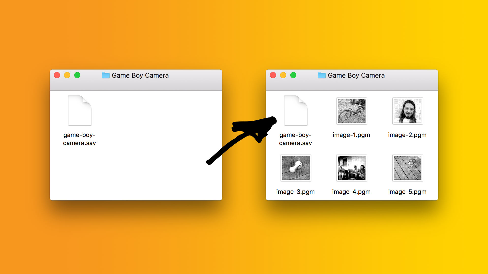

# obscura

Salvage your beautiful photographs from a Game Boy Camera save file.



Photos snapped with a Game Boy Camera is stored on a battery backed RAM on the cartridge. There are [lots of ways for you to backup that RAM][1], and thus your photos, to a save file on your computer.

Once you have that save file, pass it to `obscura`, and watch your snaps appear in [PGM image format][2].

## Extract photos from save file

Just pass a save file as a parameter to `obscura` like this:

```sh
$ obscura game-boy-camera.sav
```

You'll end up with all 30 photos in PGM format:

```sh
$ ls
game-boy-camera.sav  image-1.pgm
image-2.pgm          image-3.pgm
[...]
```

### Convert to other formats

Of course, it is easy to convert to any format you want. Here's an example using [ImageMagick][3]:

```sh
mogrify -format png *.pgm
```

## How to compile

 `obscura` is written in C, free from dependencies, and should compile and run on most platforms. Just run `make` and find the executable in the `bin` directory.

## Alternatives and resources

I developed `obscura` for my amusement and to better understand the guts of the Game Boy Camera. However, there's a handful of other ways to get your snaps off the cartridge.

* [BitBoy][4] - "Print" your images to an SD-card.
* [GBcamera Image Saver][5]  "Print" your images to your computer.
* [gbcamextract][6] - Extract PNGs from save file, requires `libpng`.

I had great use of the following resources.

* [PGM Format Specification][7] - PGM is simple to implement.
* [GB Camera Tech Info][8] - Information about the Game Boy Camera's save format.

[1]: https://www.reddit.com/r/Gameboy/comments/4w8xjf/guide_how_to_backup_your_game_save_files/
[2]: http://netpbm.sourceforge.net/doc/pgm.html
[3]: https://www.imagemagick.org/
[4]: http://gameboyphoto.bigcartel.com/product/bitboy
[5]: https://importhack.wordpress.com/2014/04/17/gbcamera-imagesaver/
[6]: https://github.com/jkbenaim/gbcamextract
[7]: http://netpbm.sourceforge.net/doc/pgm.html
[8]: http://www.devrs.com/gb/files/gbcam.txt
